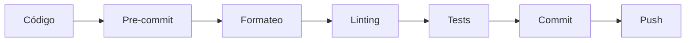

# ⚙️ Configuración de Desarrollo - Sistema Hefest

Configuraciones específicas para entorno de desarrollo, herramientas de calidad y automatización.

---

## 📋 Índice de Contenidos

| Sección | Líneas | Descripción |
|---------|--------|-------------|
| [📁 Archivos de Configuración](#-archivos-de-configuración) | 18-32 | Configuraciones específicas de desarrollo |
| [🔧 Uso y Configuración](#-uso-y-configuración) | 34-55 | Comandos e instrucciones de uso |
| [🛠️ Herramientas Incluidas](#%EF%B8%8F-herramientas-incluidas) | 57-fin | Hooks y herramientas de calidad |

---

## 📁 Archivos de Configuración

### 🔧 Configuraciones Principales

| Archivo | Propósito | Descripción |
|---------|-----------|-------------|
| `pyproject.dev.toml` | Build desarrollo | Configuración específica para desarrollo |
| `.pre-commit-config.yaml` | Quality hooks | Hooks de calidad y formateo |

### 📊 Características de Desarrollo

#### ✅ `pyproject.dev.toml`
- **Versiones dinámicas**: Builds de desarrollo versionados
- **Debug mode**: Logging detallado habilitado
- **Base de datos separada**: `data/hefest_dev.db`
- **Hot-reload**: Recarga automática de UI
- **Development dependencies**: Herramientas de desarrollo incluidas

#### ✅ `.pre-commit-config.yaml`
- **Formateo automático**: Black e isort configurados
- **Linting**: Flake8 y mypy para calidad de código
- **Testing automático**: Pytest en pre-commit
- **Validación**: YAML, JSON y otros formatos

---

## � Uso y Configuración

### 🎯 Configurar Pre-commit Hooks

```bash
# Instalar pre-commit
pip install pre-commit

# Instalar hooks del proyecto
pre-commit install --config development-config/.pre-commit-config.yaml

# Ejecutar manualmente en todos los archivos
pre-commit run --all-files

# Actualizar hooks a últimas versiones
pre-commit autoupdate
```

### 🏗️ Build de Desarrollo

```bash
# Usar configuración específica de desarrollo
export HEFEST_CONFIG=development-config/pyproject.dev.toml

# Build con configuración de desarrollo
python -m build --config-setting=--config-file=development-config/pyproject.dev.toml

# Instalación en modo desarrollo
pip install -e . --config development-config/pyproject.dev.toml
```

### � Testing y Validación

```bash
# Tests con configuración de desarrollo
pytest --config=development-config/pyproject.dev.toml

# Linting con configuración específica
flake8 --config=development-config/.flake8

# Type checking
mypy --config-file=development-config/mypy.ini
```

---

## 🛠️ Herramientas Incluidas

### 🎯 Hooks de Pre-commit Configurados

| Hook | Propósito | Trigger |
|------|-----------|---------|
| `trailing-whitespace` | Eliminar espacios finales | Pre-commit |
| `end-of-file-fixer` | Nueva línea al final | Pre-commit |
| `check-yaml` | Validar sintaxis YAML | Pre-commit |
| `check-json` | Validar sintaxis JSON | Pre-commit |
| `black` | Formateo de código Python | Pre-commit |
| `isort` | Ordenamiento de imports | Pre-commit |
| `flake8` | Linting de código | Pre-commit |
| `mypy` | Type checking | Pre-commit |
| `pytest` | Tests unitarios | Pre-commit |

### ⚙️ Variables de Entorno de Desarrollo

#### Configuración de Aplicación
```env
HEFEST_ENV=development
HEFEST_DEBUG=true
HEFEST_LOG_LEVEL=DEBUG
HEFEST_HOT_RELOAD=true
```

#### Base de Datos de Desarrollo
```env
HEFEST_DB=data/hefest_dev.db
HEFEST_DB_ECHO=true
HEFEST_DB_POOL_SIZE=5
```

#### UI y Frontend
```env
HEFEST_UI_DEBUG=true
HEFEST_UI_RELOAD=true
QT_LOGGING_RULES=*.debug=true
```

### 🔧 Herramientas de Calidad

#### ✅ Formateo y Linting
- **Black**: Formateo consistente de código
- **isort**: Organización automática de imports
- **Flake8**: Detección de errores y estilo
- **Mypy**: Verificación de tipos estática

#### ✅ Testing y Validación
- **Pytest**: Framework de testing principal
- **Coverage**: Medición de cobertura de código
- **Pre-commit**: Validación automática antes de commit

#### ✅ Configuración IDE
- **VS Code**: Settings y extensiones recomendadas
- **PyCharm**: Configuración de proyecto
- **EditorConfig**: Configuración universal de editor

### 📊 Flujo de Desarrollo



---

**📖 Para configurar desarrollo**: Ejecuta `pre-commit install --config development-config/.pre-commit-config.yaml` y configura las variables de entorno según tu necesidad.
