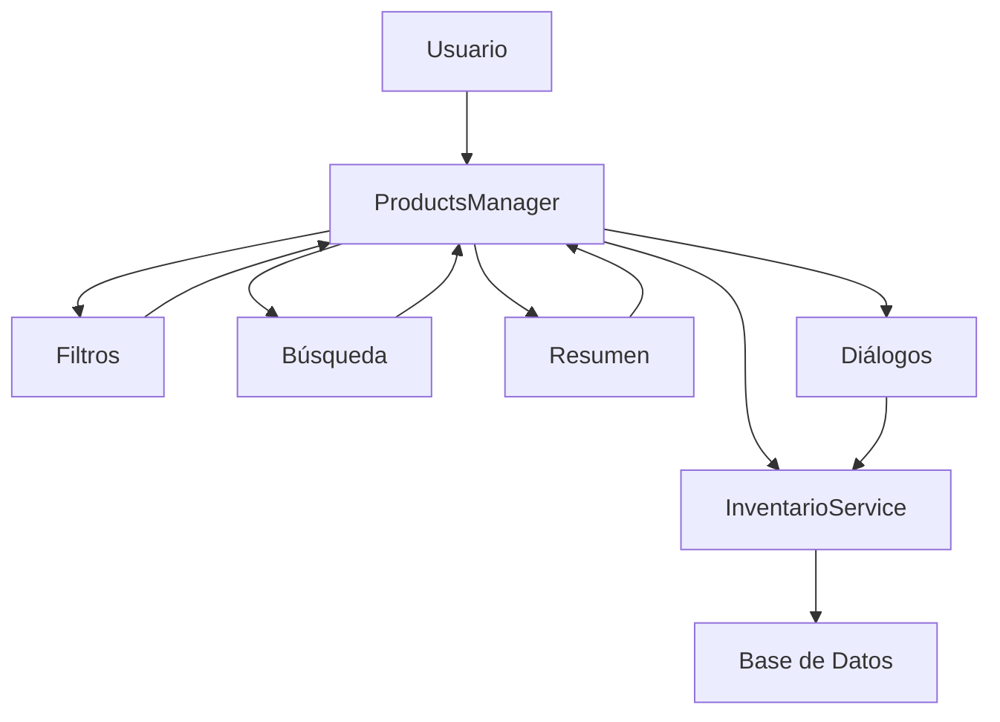

# Módulo de Inventario - Hefest v0.0.12

## 📋 Descripción General

Módulo completo de gestión de inventario diseñado específicamente para establecimientos de hostelería. Proporciona todas las funcionalidades necesarias para el control eficiente de productos, stock y proveedores.

## 🏗️ Arquitectura del Módulo

```
inventario_module/
├── __init__.py                 # Configuración del módulo
├── inventario_module.py        # Punto de entrada principal
├── README.md                   # Esta documentación
│
├── components/                 # Componentes principales
│   ├── products_manager.py     # Gestor principal de productos (CRUD)
│   ├── category_manager.py     # Gestión de categorías
│   ├── inventory_table.py      # Tabla de inventario especializada
│   └── supplier_manager.py     # Gestión de proveedores
│
├── dialogs/                    # Diálogos modales
│   ├── __init__.py            # Exportaciones del paquete
│   └── product_dialogs_pro.py  # Diálogos profesionales de productos
│
└── widgets/                    # Widgets auxiliares
    ├── __init__.py            # Configuración de widgets
    ├── inventory_filters.py    # Filtros avanzados
    ├── inventory_summary.py    # Resumen ejecutivo
    └── product_search.py       # Búsqueda inteligente
```

## 🎯 Componentes Principales

### 1. ProductsManager (`components/products_manager.py`)
**Rol:** Controlador central y vista principal
- ✅ CRUD completo de productos
- ✅ Gestión de stock en tiempo real
- ✅ Importación/Exportación de datos
- ✅ Integración con todos los widgets auxiliares

### 2. Diálogos Profesionales (`dialogs/product_dialogs_pro.py`)
**Rol:** Interfaces modales para entrada de datos
- ✅ NewProductDialog - Crear productos
- ✅ EditProductDialog - Editar productos
- ✅ StockAdjustmentDialog - Ajustar inventario
- ✅ DeleteConfirmationDialog - Confirmar eliminaciones

### 3. Widgets Auxiliares
**Rol:** Componentes especializados reutilizables

#### InventoryFiltersWidget (`widgets/inventory_filters.py`)
- Filtros por categoría, proveedor, stock, precio
- Búsqueda combinada con lógica AND
- Limpieza rápida de filtros

#### InventorySummaryWidget (`widgets/inventory_summary.py`)
- Métricas clave del inventario
- Alertas visuales (stock crítico, sin movimiento)
- Dashboard ejecutivo con colores intuitivos

#### ProductSearchWidget (`widgets/product_search.py`)
- Búsqueda en tiempo real con debounce
- Autocompletado inteligente
- Historial de búsquedas recientes

## 🔧 Dependencias Técnicas

### Servicios Backend
- `services.inventario_service_real` - Capa de datos y lógica de negocio
- `data.db_manager` - Gestión de base de datos SQLite

### UI Framework
- `PyQt6` - Framework de interfaz gráfica
- `utils.modern_styles` - Estilos personalizados

### Librerías Auxiliares
- `logging` - Sistema de logs
- `typing` - Type hints para robustez
- `datetime` - Manejo de fechas

## 📊 Funcionalidades por Categoría

### 🏪 Gestión de Productos
- [x] Crear productos con validaciones completas
- [x] Editar información de productos existentes
- [x] Eliminar productos con confirmación
- [x] Duplicar productos para agilizar creación
- [x] Búsqueda avanzada multi-criterio
- [x] Filtros combinables (categoría, proveedor, stock, precio)

### 📦 Control de Stock
- [x] Ajustar stock manualmente con motivos
- [x] Alertas automáticas de stock bajo
- [x] Histórico de movimientos de inventario
- [x] Cálculo automático de rotación de stock
- [x] Predicción de necesidades de reposición

### 💰 Gestión Financiera
- [x] Cálculo automático de precios con IVA
- [x] Gestión de márgenes de beneficio
- [x] Análisis de rentabilidad por producto
- [x] Estadísticas de valor total del inventario

### 🏷️ Organización
- [x] Categorías predefinidas para hostelería
- [x] Gestión de proveedores con contactos
- [x] Códigos de producto y EAN/SKU
- [x] Etiquetas y clasificaciones personalizadas

### 📈 Reporting y Analytics
- [x] Dashboard ejecutivo con métricas clave
- [x] Exportación a CSV y Excel
- [x] Reportes de productos sin movimiento
- [x] Análisis de tendencias de consumo

## 🎨 Diseño de Interfaz

### Principios de Diseño
- **Consistencia:** Estilos unificados en todo el módulo
- **Usabilidad:** Interfaz intuitiva para usuarios no técnicos
- **Responsive:** Adaptable a diferentes tamaños de pantalla
- **Accesibilidad:** Colores y contrastes apropiados

### Paleta de Colores
- 🟢 **Verde:** Estado OK, operaciones exitosas
- 🟡 **Amarillo:** Precaución, stock bajo
- 🔴 **Rojo:** Crítico, errores, stock agotado
- 🔵 **Azul:** Información, acciones principales
- ⚪ **Gris:** Estados neutros, deshabilitado

## 🔄 Flujo de Datos



## 🚀 Inicio Rápido

### Para Desarrolladores
```python
from src.ui.modules.inventario_module import InventarioModule

# Inicializar módulo
inventario = InventarioModule()

# Mostrar interfaz
inventario.show()
```

### Para Usuarios Finales
1. **Crear Producto:** Botón "Nuevo Producto" → Rellenar formulario → Guardar
2. **Buscar Producto:** Usar barra de búsqueda o filtros avanzados
3. **Ajustar Stock:** Seleccionar producto → "Ajustar Stock" → Indicar cantidad
4. **Ver Resumen:** Panel superior muestra métricas en tiempo real

## 🐛 Solución de Problemas

### Problemas Comunes

**Error de conexión con la base de datos:**
```bash
ERROR: No se puede conectar a la base de datos
SOLUCIÓN: Verificar que hefest.db existe y tiene permisos
```

**Productos no aparecen en la tabla:**
```bash
CAUSA: Filtros activos o datos no cargados
SOLUCIÓN: Limpiar filtros o revisar logs del servicio
```

**Diálogos no se abren:**
```bash
CAUSA: Error en importaciones o dependencias
SOLUCIÓN: Verificar __init__.py y reinstalar dependencias
```

## 📝 Logs y Debugging

### Activar Logs Detallados
```python
import logging
logging.getLogger('inventario_module').setLevel(logging.DEBUG)
```

### Archivos de Log
- `logs/hefest.log` - Log general de la aplicación
- `logs/debug/inventario_*.log` - Logs específicos del módulo

## 🔧 Configuración Avanzada

### Variables de Entorno
```bash
HEFEST_DB_PATH=./data/hefest.db          # Ruta de la base de datos
HEFEST_LOG_LEVEL=INFO                    # Nivel de logging
HEFEST_AUTO_UPDATE_INTERVAL=30           # Intervalo de actualización (seg)
```

### Personalización de Categorías
Editar en `inventario_service_real.py`:
```python
CATEGORIAS_HOSTELERIA = [
    "Bebidas Alcohólicas", "Bebidas No Alcohólicas",
    "Productos Frescos", "Congelados", "Conservas",
    "Limpieza", "Menaje", "Uniformes"
]
```

## 📚 Referencias Técnicas

### Archivos Clave para Mantenimiento
- `inventario_service_real.py` - Lógica de negocio y validaciones
- `products_manager.py` - Controlador principal de la UI
- `product_dialogs_pro.py` - Formularios de entrada de datos

### APIs Principales
- `obtener_productos()` - Listar todos los productos
- `crear_producto(datos)` - Crear nuevo producto
- `actualizar_producto(id, datos)` - Actualizar producto existente
- `eliminar_producto(id)` - Eliminar producto
- `ajustar_stock(id, cantidad, motivo)` - Modificar stock

---

## 📊 Estado del Módulo

### ✅ Completado y Funcional (v0.0.12)
- [x] CRUD completo de productos
- [x] Gestión de stock con alertas
- [x] Filtros y búsqueda avanzada
- [x] Diálogos profesionales
- [x] Integración con base de datos
- [x] Validaciones robustas
- [x] Logs y manejo de errores
- [x] Documentación completa

### 🔄 Mejoras Futuras
- [ ] Integración con códigos QR/códigos de barras
- [ ] Sincronización con proveedores (API)
- [ ] Alertas automáticas por email/SMS
- [ ] Análisis predictivo de demanda
- [ ] Integración con TPV/Punto de venta

---

**Autor:** Hefest Development Team  
**Versión:** v0.0.12  
**Fecha:** Diciembre 2024  
**Licencia:** Propietaria - Hefest Systems
